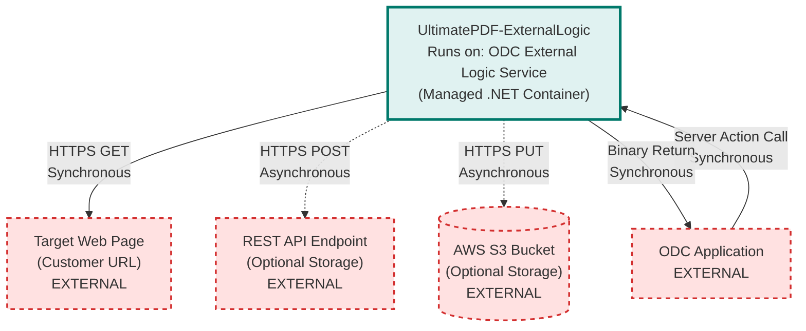

# UltimatePDF-ExternalLogic Architecture

> **Repository:** UltimatePDF-ExternalLogic
> **Runtime Environment:** OutSystems Developer Cloud (ODC) External Logic Service
> **Last Updated:** 2026-03-12

## Overview

This repository provides PDF generation capabilities for OutSystems Developer Cloud (ODC) applications by leveraging Chromium's rendering engine to convert web pages into PDF documents. The code runs as external logic (custom C# code) within ODC's managed infrastructure.

## Architecture Diagram



## External Integrations

| External Service | Communication Type | Purpose |
|------------------|-------------------|---------|
| ODC Application | Sync (Server Action) | Receives PDF generation requests from ODC apps via external logic interface |
| Target Web Page | Sync (HTTPS GET) | Fetches HTML content to render using embedded Chromium browser |
| REST API Endpoint | Async (HTTPS POST) | Optional: Stores generated PDF and logs when payload exceeds 5.5MB limit |
| AWS S3 Bucket | Async (HTTPS PUT) | Optional: Uploads PDF and logs to S3 using presigned URLs |

## Architectural Tenets

### T1. External Logic Interface Isolation

The public API surface is strictly defined through the `IUltimatePDF_ExternalLogic` interface using OutSystems SDK attributes. All implementation classes remain internal, exposing only the contract required by ODC.

**Evidence:**
- `UltimatePDF_ExternalLogic/IUltimatePDF_ExternalLogic.cs` (interface `IUltimatePDF_ExternalLogic`) - declares four public actions: `PrintPDF`, `PrintPDF_ToRest`, `PrintPDF_ToS3`, `ScreenshotPNG`
- `UltimatePDF_ExternalLogic/UltimatePDF_ExternalLogic.cs` (class `UltimatePDF_ExternalLogic`) - only public class, implements the interface
- `UltimatePDF_ExternalLogic/BrowserExecution/` - all classes marked `internal` (e.g., `UltimatePDFExecutionContext`, `BrowserInstancePool`)
- `UltimatePDF_ExternalLogic/Utils/` - utility classes like `RestSender`, `S3Sender`, `UrlUtils` all marked `internal`

**Rationale:** This boundary prevents ODC applications from directly accessing implementation details and ensures backward compatibility. Only the SDK-decorated interface methods are visible to OutSystems developers.

### T2. Synchronous Execution with Asynchronous Storage Options

Core PDF generation is synchronous (request-response), but large payloads use asynchronous storage to external endpoints. The caller decides storage strategy by choosing which action to invoke.

**Evidence:**
- `UltimatePDF_ExternalLogic/UltimatePDF_ExternalLogic.cs` (in `PrintPDF` method) - returns `byte[]` directly, throws exception if output exceeds 5.5MB
- `UltimatePDF_ExternalLogic/UltimatePDF_ExternalLogic.cs` (in `PrintPDF_ToRest` method) - returns `void`, sends PDF via `RestSender.RestSendPDFAsync`
- `UltimatePDF_ExternalLogic/UltimatePDF_ExternalLogic.cs` (in `PrintPDF_ToS3` method) - returns `void`, uploads PDF via `S3Sender.S3SendPDFAsync`
- `UltimatePDF_ExternalLogic/Utils/AsyncUtils.cs` (in `StartAndWait` methods) - wraps async operations in synchronous blocking calls

**Rationale:** ODC external logic has a 95-second timeout and 5.5MB payload limit. For small PDFs, synchronous return is fastest. For large PDFs, the library delegates storage to REST or S3, staying within platform constraints while supporting enterprise-scale documents.

### T3. Browser Instance Pooling and Reuse

Chromium browser instances are expensive to initialize. The library maintains a pool of reusable browser instances across invocations to amortize startup costs.

**Evidence:**
- `UltimatePDF_ExternalLogic/BrowserExecution/BrowserInstancePool.cs` (in `BrowserInstancePool` class) - maintains `static readonly List<PooledBrowserInstance> pool`
- `UltimatePDF_ExternalLogic/BrowserExecution/BrowserInstancePool.cs` (in `NewBrowserInstance` method) - checks `pool.FirstOrDefault(i => i.IsHealthy)` before creating new instance
- `UltimatePDF_ExternalLogic/BrowserExecution/ODCUltimatePDFExecutionContext.cs` (in `PrintPDF` method) - uses `pool.NewPooledPage(logger)` instead of direct browser instantiation

**Rationale:** Cold-start penalty for launching Chromium can exceed 10 seconds. By reusing browser instances within a 10-15 minute window (typical external logic infrastructure lifecycle), subsequent requests complete in under 5 seconds. The pool is thread-safe via `SemaphoreSlim` to prevent race conditions.

### T4. Layered PDF Construction Pipeline

PDF generation follows a multi-stage pipeline: render content, merge backgrounds, calculate pagination, then merge headers/footers. Each stage produces intermediate PDFs that are composed using PDFsharp.

**Evidence:**
- `UltimatePDF_ExternalLogic/LayoutPrintPipeline/Pipeline.cs` (in `Render` method) - orchestrates stages: main content → page background → pagination calculation → headers → footers
- `UltimatePDF_ExternalLogic/LayoutPrintPipeline/Pipeline.cs` (in `MergeBackground`, `MergeHeaders`, `MergeFooters` methods) - each stage merges separate PDF layers using `XPdfForm` and `XGraphics`
- `UltimatePDF_ExternalLogic/BrowserExecution/ODCUltimatePDFExecutionContext.cs` (in `PrintPDF` method) - detects layouts via JavaScript: `await pipeline.Initialize(pooled.Page)`, falls back to simple render if `!pipeline.HasLayouts`

**Rationale:** Headers and footers require page numbers, which are unknown until content is rendered. The pipeline separates concerns: Chromium generates raw PDFs for each layer, then PDFsharp composites them. This allows dynamic pagination (e.g., "Page 3 of 10") without multiple browser render passes.

### T5. Structured Logging with Conditional Attachment

Logging is opt-in and configurable. When enabled, the library captures execution traces, browser logs, and generated artifacts (HTML, PDF, screenshots) in a ZIP file for troubleshooting.

**Evidence:**
- `UltimatePDF_ExternalLogic/Management/Troubleshooting/Logger.cs` (in `GetLogger` method) - returns `NullLogger` when `collectLogs == false`
- `UltimatePDF_ExternalLogic/Management/Troubleshooting/Logger.cs` (in `Attach` method) - only stores attachments if `attachFilesLogs == true`
- `UltimatePDF_ExternalLogic/UltimatePDF_ExternalLogic.cs` (in `PrintPDF` method) - exposes `collectLogs` and `attachFilesLogs` parameters, returns `logsZipFile` as output
- `UltimatePDF_ExternalLogic/BrowserExecution/ODCUltimatePDFExecutionContext.cs` (in `PrintPDF` method) - conditionally calls `logger.Attach("input.html", ...)` and `logger.Attach("output.pdf", ...)`

**Rationale:** Detailed logging is expensive (memory, processing time) and adds to payload size. By making it opt-in, production traffic runs lean. When investigating issues, developers enable logging to capture full diagnostic context without modifying code. The ZIP output stays under 5.5MB by making file attachments separately configurable.

## Platform Constraints

This component operates within ODC's external logic environment, subject to:

- **Execution timeout:** 95 seconds maximum per invocation (configurable via Server Request Timeout in ODC app settings)
- **Payload limit:** 5.5MB for combined input + output. Use `PrintPDF_ToRest` or `PrintPDF_ToS3` for larger PDFs.
- **Cold start:** First execution after idle period takes 10+ seconds due to Chromium initialization. Subsequent calls within 10-15 minutes reuse pooled browsers.
- **HTTPS-only:** Target URLs must use HTTPS scheme (validated by `UrlUtils.IsValidHttpsUri`)
- **No IP filtering support:** External logic runs outside tenant network, bypassing IP filters configured in ODC stages

## Deployment

The library is packaged as a ZIP file containing compiled .NET 8.0 binaries for linux-x64 runtime. Generate the package by running:

```bash
.\generate_upload_package.ps1
```

Upload `UltimatePDF_ExternalLogic.zip` to ODC Portal under Configuration → External Logic. The SDK automatically generates server actions in ODC Studio based on the `[OSAction]` attributes in `IUltimatePDF_ExternalLogic`.

Companion OutSystems modules in the `oml/` directory provide client-side accelerators:
- `Ultimate PDF.oml` - library with wrapper actions and UI blocks
- `Template_UltimatePDF.oml` - application template with token-based authentication and REST API for PDF storage
- `Ultimate PDF Tests.oml` - test scenarios for validation

## Technology Stack

- **.NET 8.0:** Target framework for ODC external logic
- **PuppeteerSharp:** Browser automation library wrapping Chromium DevTools Protocol
- **HeadlessChromium.Puppeteer.Lambda.Dotnet:** Provides Chromium binaries compatible with AWS Lambda (ODC infrastructure)
- **PDFsharp 6.2.0:** PDF manipulation for merging layers (backgrounds, headers, footers)
- **OutSystems.ExternalLibraries.SDK 1.5.0:** Attributes for exposing C# methods as ODC server actions
