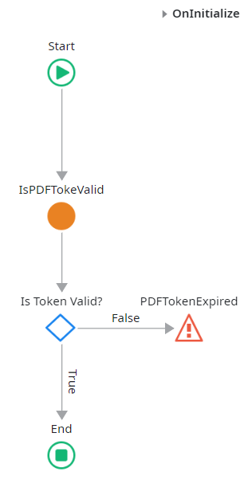
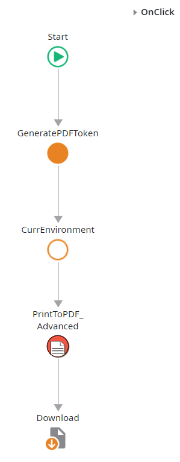
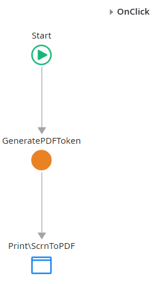

<a name="readme-top"></a>

<!-- PROJECT LOGO -->
<br />
<div align="center">
  <a href="https://github.com/OutSystems/ODC-VG-UltimatePDF-Service">
    
  </a>

  <h3 align="center"><b>Ultimate PDF</b></h3>
  
  <p align="center">
    Generate PDF reports by using modern web technologies.
  </p>
</div>

<!-- TABLE OF CONTENTS -->
<details open>
  <summary>Table of Contents</summary>
  <ol>
    <li><a href="#about-the-project">About The Project</a></li>
    <li>
      <a href="#getting-started">Getting Started</a>
      <ul>
        <li><a href="#prerequisites">Prerequisites</a></li>
        <li><a href="#installation">Installation</a></li>
      </ul>
    </li>
    <li><a href="#usage">Usage</a></li>
    <li>
      <a href="#advance-scenarios">Advance Scenarios</a>
      <ul>
        <li><a href="#prerequisites-1">Prerequisites</a></li>
        <li><a href="#advance-pdf-generation">Advance PDF Generation</a></li>
        <li><a href="#screen-to-pdf">Screen to PDF</a></li>
        <li><a href="#external-logic-call-rest-api-to-store-the-pdf">External Logic call Rest API to store the PDF</a></li>
      </ul>
    </li>
    <li><a href="#license">License</a></li>
    <li><a href="#known-limitations">Known Limitations</a></li>
    <li><a href="#get-in-touch">Get in touch</a></li>
    <li><a href="#contributing">Contributing</a></li>
    <li><a href="#acknowledgments">Acknowledgments</a></li>
  </ol>
</details>

## About The Project

Project that enables ODC customers to generate PDFs using modern web technologies.

This component uses the same rendering engine as Chromium (an open-source version of Google Chrome) to transform web pages into PDF documents.

This component is based on the O11 version of <a href="https://www.outsystems.com/forge/component-overview/5641/ultimate-pdf">Ultimate PDF</a>.

<b>THIS CODE IS NOT SUPPORTED BY OUTSYSTEMS.</b>

<p align="right">(<a href="#readme-top">back to top</a>)</p>

## Getting Started

This repo contains all the external code (C#) and the modules that can be used to accelerate the development of PDFs at ODC Applications.

### Prerequisites

To generate the External Logic package run 
```sh
.\generate_upload_package.ps1
```

### Installation

This component is published at forge. So the best way to install it on your ODC tenant is by searching for:
* UltimatePDF_ExternalLogic
* Ultimate PDF
* _(Optional)_ Template_UltimatePDF

#### From the repo

The code will generate the file `UltimatePDF_ExternalLogic.zip` that can be uploaded to the ODC Portal as external logic (<a href="https://success.outsystems.com/documentation/outsystems_developer_cloud/building_apps/extend_your_apps_with_external_logic_using_custom_code/">documentation</a>).

Use ODC Studio to publish the modules
* Ultimate PDF.oml - Library with accelerators to use the code from the External Logic actions
* Template_UltimatePDF.oml - Application template that is ready to have 

<p align="right">(<a href="#readme-top">back to top</a>)</p>

## Usage

The simplest way to generate a PDF is by:

1. Create an empty screen
1. Add to the screen the web block `PrintLayout` (from UltimatePDF)
1. Build the report
1. Call the server action `PrintToPDF` to generate the PDF (from UltimatePDF)

<p align="right">(<a href="#readme-top">back to top</a>)</p>

## Public Elements

All the listed public elements are present in the library **Ultimate PDF**.

### Block

- **PageCount**: Displays the total number of pages. Use inside the header of footer of PrintLayout.  See also: PrintLayout.
- **PageNumber**: Displays the current page number. Use inside the header of footer of PrintLayout.  See also: PrintLayout.
- **PageBreak**: Force a page break.
- **SectionBreak**: Breaks a section between two PrintLayout blocks, and allows to control how pagination continues on the new section.
- **PrintLayout**: Creates a page layout, including header and footer placeholders that are repeated on every page, and a page background that can be used for watermarks and other full-bleed design elements.  See also: ScreenToPDF.
- **ScreenToPDF**: Automatically converts a screen into PDF, such that any navigation to the screen automatically downloads it as a PDF.
- **HideOnPrint**: Content will not be shown on print media.
- **ShowOnPrint**: Content will only be shown on print media.

### Client actions

- **OnApplicationReady_UltimatePDF**: Loads support for Ultimate PDF on reactive applications.  This action must be invoked during the OnApplicationReady event. Some features of Ultimate PDF may not work otherwise.
- **ScreenToPDF_OnInitialize**: Initializes a screen that is using ScreenToPDF block.  This action must be invoked during the OnInitialize event of the screen. The ScreenToPDF block will not work otherwise.
- **CurrEnvironment**: Current Environment information.
- **GetDefaultViewport**: Defines a default viewport size of 1366x768

### Server actions

- **PrintToPDF**: Generates a PDF from a given URL, using the paper size and margin size from the print stylesheet.
- **PrintToPDF_Advanced**: Generates a PDF from a given URL, specifying paper size and margin size.
- **ScreenshotToPNG**: Generates a screenshot (PNG) from a given URL, using the paper size and margin size from the print stylesheet.
- **ScreenshotToPNG_Advanced**: Generates a screenshot (PNG) from a given URL, specifying paper size and margin size.
- **GetDefaultViewport**: Defines a default viewport size of 1366x768

### Static Entities

- **MarginSize**: Common document margin sizes.
- **PaperSize**: Common paper sizes.

## Advance Scenarios

### Prerequisites

In the instructions bellow we will assume that the application that is generating the PDFs was created based on Template_UltimatePDF. This Template creates an application that contains:
* REST API `pdf` - that implements an API to store the PDF on the application
* Entity `GeneratePDF` - contains information for the pdf and the token authentication for the the pages
* Entity `GeneratedPDF_Files` - entity where the REST API saves the PDF files
* Entity `GeneratedPDF_Logs` - entity where the REST API saves the Log files

### Advance PDF Generation

1. Create a Flow named *Print*, if not present
1. Add an empty screen
1. Under the Authorization properties, select `Everyone`
1. Add an input parameter named `Token` (Data Type = Text, Is Mandatory = Yes)
1. Delete the web block `Layouts\LayoutTopMenu`
1. Fill the screen with the information to have in the PDF
1. Add `On Initialize` event, and add a call to IsPDFTokenValid with the `Token` as parameter
1. Add a if clause `IsPDFTokeValid.Valid`, and end the *False* branch with and exception `PDFTokenExpired`
1. Add `On Ready` event, and add a call to `ExpireToken` with the `Token` as parameter
1. On another screen create a button to generate the PDF
1. Call the Server Action `GeneratePDFToken`
1. Call the Server Action `PrintToPDF_Advanced`
  * URL - url for the page to be generated. In this example, the screen was created at _2._
  * Environment - information of the environment where the browser will be launched. Can use the output of the Client Action `CurrEnvironment`
  * PaperSize - Paper size measures separated by _x_ (eg: "21.00x29.70"). Can use the Static Entity `PaperSize` from `UltimatePDF`
  * MarginSize - Paper margin size separated by _x_ (eg: "2.50x3.00x2.50x3.00"). Can use the Static Entity `MarginSize` from `UltimatePDF`
  * CollectLogs - If the execution of the external logic collects logs. If True, the output parameter LogsZipFile has the logs, it's empty otherwise.
  * Cookies - Cookie values to be used in the browser that will be launched.
  * TimeoutSeconds - Timeout in seconds the browser will wait to render and generate the PDF
  * RestCaller - REST API information for the external logic to store the PDF and the LogsZipFile.
  * PDF _(Output parameter)_ - The PDF file binary data. Empty if RestCaller is passed.
  * LogsZipFile _(Output parameter)_ - The logs of the external logic execution. Empty if RestCaller is passed.
1. Call Download with the output parameter *PDF* of the Server Action `PrintToPDF_Advanced`



### Screen to PDF

1. Create a Flow named *Print*, if not present
1. Add an empty screen
1. Under the Authorization properties, select `Everyone`
1. Add an input parameter named `Token` (Data Type = Text, Is Mandatory = Yes)
1. Delete the web block `Layouts\LayoutTopMenu`
1. Add the web block `PrintLayout\ScreenToPDF`
1. Fill the screen with the information to have in the PDF
1. Add `On Initialize` event, and add a call to `IsPDFTokenValid` with the `Token` as parameter
1. Add a if clause `IsPDFTokeValid.Valid`, and end the *False* branch with and exception `PDFTokenExpired`
1. Add a call to `ScreenToPDF_OnInitialize`
1. Add `On Ready` event, and add a call to `ExpireToken` with the `Token` as parameter
1. On another screen create a link with an action on click
1. Call the Server Action `GeneratePDFToken`
1. End the flow with a destination to the screen created at 2.



### External Logic call Rest API to store the PDF

The Template_UltimatePDF already creates a REST API named *pdf* with two methods *Store* and *StoreLogs*. The external logic expects the REST API to be implemented as POST methods with binary data as the body of the request. The API call uses the `Token` parameter as an authorization header.

1. Create a Flow named *Print*, if not present
1. Add an empty screen
1. Under the Authorization properties, select `Everyone`
1. Add an input parameter named `Token` (Data Type = Text, Is Mandatory = Yes)
1. Delete the web block `Layouts\LayoutTopMenu`
1. Fill the screen with the information to have in the PDF
1. Add `On Initialize` event, and add a call to IsPDFTokenValid with the `Token` as parameter
1. Add a if clause `IsPDFTokeValid.Valid`, and end the *False* branch with and exception `PDFTokenExpired`
1. On another screen create a button to generate the PDF
1. Call the Server Action `GeneratePDFToken`
1. Call the Server Action `PrintToPDF_Advanced`, fill the RestCaller parameter
  * Token - The token of the printable page, we use it for REST API authentication.
  * BaseUrl - base tenant url, eg: _https://tenant.outsystems.com_
  * Module - Name of the module that implements the REST API, can use `GetOwnerURLPath()`
  * StorePath - Rest method URL Path to store the PDF, eg: `/rest/pdf/Store`
  * LogPath - Rest method URL Path to store the logs, eg: `/rest/pdf/StoreLogs`
  * The PDF will be stored at the entity `GeneratedPDF_Files`
  * The Logs will be stored at the entity `GeneratedPDF_Logs`, if requested

### Basic page screenshot

1. Create an empty screen
1. Add to the screen the web block `PrintLayout` (from UltimatePDF)
1. Build the report
1. Call the server action `ScreenshotToPNG` to generate the image (from UltimatePDF)


## License

BSD-3 license. See <a href="LICENSE">LICENSE</a> for more information.

<p align="right">(<a href="#readme-top">back to top</a>)</p>

## Known Limitations

* The screens to print cannot be protected by authentication. We recommend the screens to be protected by tokens. See the usage of `GeneratePDFToken` on this documentation for examples.
* The input and output payload of the external logic cannot be greater than 5.5MB. <a href="#external-logic-call-rest-api-to-store-the-pdf">Workaround use the REST API Store functionality</a>.

<p align="right">(<a href="#readme-top">back to top</a>)</p>

## Get in touch

Help us improve `UltimatePDF-ExternalLogic` by either:
* <a href="https://github.com/OutSystems/UltimatePDF-ExternalLogic/issues">Submitting an issue</a> with detailed information about the problem you're having
* <a href="mailto:vanguard@outsystems.com">Sending us an email</a> with any feedback or questions that you may have

<p align="right">(<a href="#readme-top">back to top</a>)</p>

## Contributing

1. Do a repository Fork;
1. Create a branch based in the branch master (latest & greatest release);
1. Open the branch with you favorite C# code editor;
1. Make your code change;
1. Document your code;
1. Install the external logic in your tenant and test;
1. Kept the branch updated with the master branch and also synchronized with the upstream master;
1. Create a PR, describing what was the (mis)behavior, what you changed and please provide a sample;
1. Address any feedback in code review.

<p align="right">(<a href="#readme-top">back to top</a>)</p>

## Acknowledgments

Project base on OutSystems Forge component <a href="https://www.outsystems.com/forge/component-overview/5641/ultimate-pdf">Ultimate PDF</a>.

<p align="right">(<a href="#readme-top">back to top</a>)</p>
